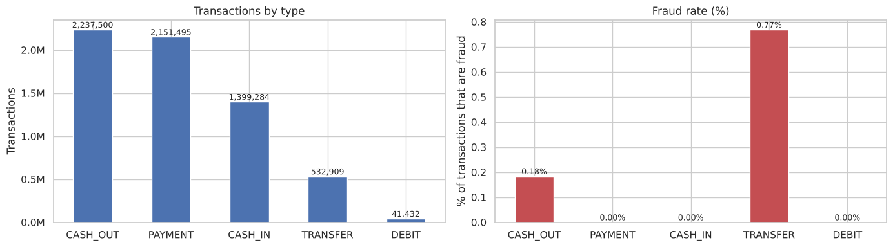
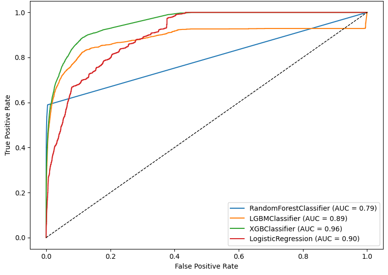

# Fraud Detection in Mobile Money

Notebook: [`fraud_detection.ipynb`](fraud_detection.ipynb)

## Problem

Detect fraudulent transactions in a mobile money system where fraud is very rare: 0.13% of 6.3 million transactions. The data comes from [PaySim](https://www.kaggle.com/datasets/ealaxi/paysim1), a synthetic dataset built from real mobile money logs.

## Approach

1. Exploratory analysis: amount distributions on a log scale, and fraud by transaction type and by origin and destination.
2. Feature engineering: created a transaction direction feature (customer to customer, customer to merchant) from the account IDs, then dropped the IDs so the models could not memorise accounts.
3. Leakage control: removed the balance columns. Fraudulent transactions are cancelled in the simulation, so the balances reveal the label.
4. Modelling: stratified 70/30 split, comparing Logistic Regression, Random Forest, LightGBM and XGBoost.

## Results

All fraud happens in TRANSFER and CASH_OUT transactions between two customer accounts. A transfer is about 4 times more likely to be fraud than a cash out.

XGBoost ranks transactions best (ROC AUC 0.956). At the default 0.5 threshold, however, it catches only 17% of frauds, with 92% precision. With this level of imbalance, the threshold should be set from the cost of a missed fraud versus the cost of a false alarm.

| Model | Precision (fraud) | Recall (fraud) | ROC AUC |
|---|---|---|---|
| XGBoost | 0.92 | 0.17 | 0.956 |
| Random Forest | 0.72 | 0.35 | 0.794 |
| LightGBM | 0.59 | 0.20 | 0.886 |
| Logistic Regression | 0.18 | 0.00 | 0.901 |

## Next steps

Report PR-AUC and precision-recall curves, tune the threshold to a target recall, try class weighting, validate on later time periods, and add behavioural features such as hour of day and number of transactions per account.

## How to run

Download the CSV from Kaggle into this folder and run the notebook. Libraries are listed in [`requirements.txt`](../requirements.txt).
