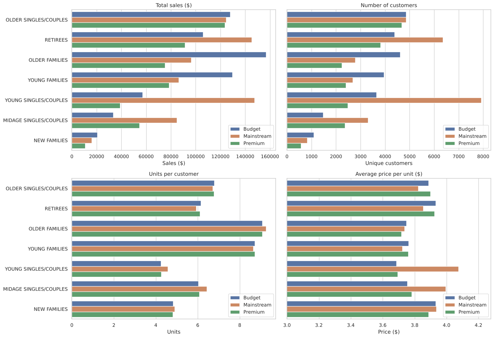
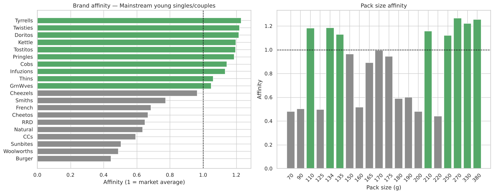

# Retail Customer Analytics — Chips Category

**Notebook:** [`retail_customer_analytics.ipynb`](retail_customer_analytics.ipynb)

## Problem
A supermarket's Category Manager for Chips wants to know **who buys chips and how**, to shape the category strategy for the next half-year. Data: 12 months of transactions (~265k rows) and loyalty-card customer segments. *(Case study from the Quantium virtual experience programme.)*

## Approach
1. **Cleaning** — Excel date conversion, removed non-chip products (salsa), removed a commercial buyer (200-pack orders), checked the calendar for gaps (only Christmas Day missing — stores closed).
2. **Feature engineering** — pack size and standardised brand from free-text product names.
3. **Segmentation** — decomposed sales by life stage × price segment into *customers × units per customer × price per unit*.
4. **Hypothesis test** — Welch's t-test on price per unit.
5. **Affinity analysis** — which brands and pack sizes the key segment over-indexes on.

## Key findings

- **Three segments drive sales:** Budget older families (8.7%), Mainstream young singles/couples (8.2%) and Mainstream retirees (8.0%).
- They win in different ways: young singles/couples and retirees through **number of customers**, families through **units per customer**.
- **Mainstream young and midage singles/couples pay more per packet** ($4.04 vs $3.71) — significant at p < 0.001.
- That segment over-indexes ~20% on **Tyrrells, Twisties, Doritos and Kettle** and on **large packs (270–380 g)**, and under-indexes on value/private-label brands.

## Recommendations
- Place the segment's preferred brands in high-visibility, impulse-purchase locations.
- Test promotions on large packs of those brands.
- Keep multi-buy offers aimed at families.
- Validate any layout change with a trial-vs-control store test before rollout.
