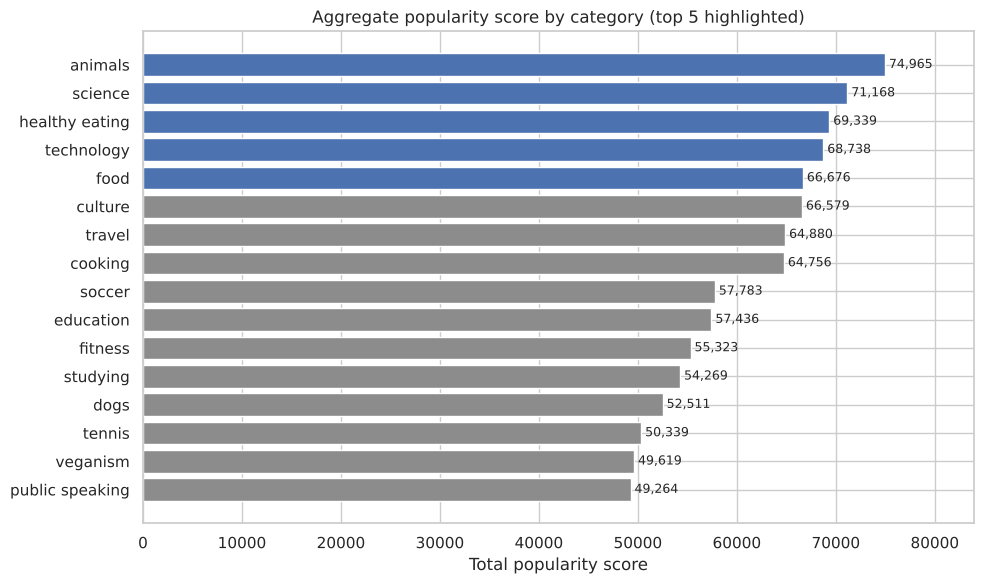

# Content Popularity Analysis — Social Media Platform

**Notebook:** [`content_popularity_analysis.ipynb`](content_popularity_analysis.ipynb) · **Brief:** [`brief/`](brief) · **Presentation:** [`report/social-buzz-presentation.pdf`](report/social-buzz-presentation.pdf)

## Problem
Social Buzz receives 100k+ posts per day and asked for **the top 5 content categories by aggregate popularity**. *(Case study from the Accenture virtual experience programme.)*

## Approach
1. Cleaned three tables (content, reactions, reaction types) — dropped irrelevant columns and unscorable reactions.
2. **Normalised category labels:** the raw data had 41 spellings for 16 categories (`animals`, `Animals`, `"animals"`).
3. Joined the tables following the client's data model and scored every reaction (0–75).
4. Ranked categories by total score; looked at sentiment mix, content type and monthly activity.

## Key findings

- **Top 5:** Animals, Science, Healthy eating, Technology, Food.
- **Food is a recurring theme** (Healthy eating and Food in the top 5, Cooking close behind) — an opportunity for partnerships with food and healthy-eating brands.
- Popularity is **volume-driven**: score per reaction is similar across categories.
- **Data quality changed the answer:** without normalising labels, Cooking appeared in the top 5 and Food did not. Recommendation: a fixed category list at upload.
