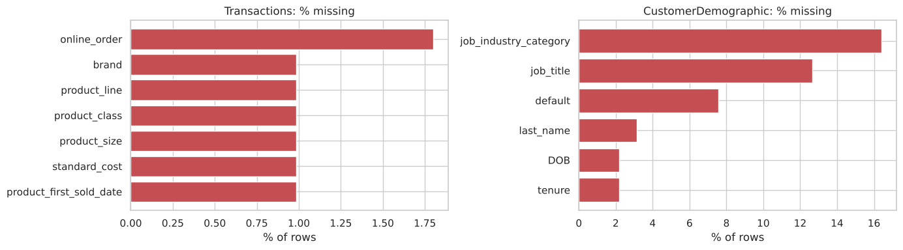
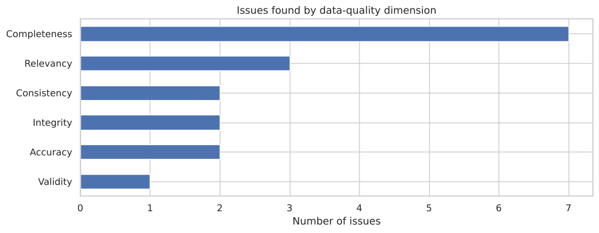

# Data Quality Assessment for a Bike Retailer

Notebook: [`data_quality_assessment.ipynb`](data_quality_assessment.ipynb)

## Problem

Sprocket Central, a bike retailer, wants to target its most valuable customers. Before any modelling, the client asked for an assessment of its data quality and recommendations to fix it. The data has 20,000 transactions, 4,000 customer profiles and 4,000 addresses. This is a case study from the KPMG virtual experience programme.

## Approach

I checked each table against six data quality dimensions: completeness, consistency, accuracy, validity, integrity and relevancy. Each issue went into a log with the number of rows affected and a proposed fix. No data was removed without being recorded first.

## Results

The log has 17 issues. The main ones:

- Completeness: 16% of customers have no industry and 13% have no job title. 197 transactions have no product details.
- Consistency: gender is written as `F`, `Femal` and `Female`, and states as `NSW` and `New South Wales`.
- Accuracy: one customer was born in 1843, the `default` column contains only unreadable strings, and one industry is misspelled (`Argiculture`).
- Integrity: one customer ID in the transactions has no customer record, and the customer and address tables do not fully match.
- Relevancy: cancelled orders and deceased customers should be excluded from targeting.

## Recommendations

Use fixed lists (dropdowns) for gender, state and industry when data is entered, validate dates of birth, keep customer IDs in sync between systems, and drop unusable fields at the source. The notebook ends by applying all fixes and producing clean tables.
