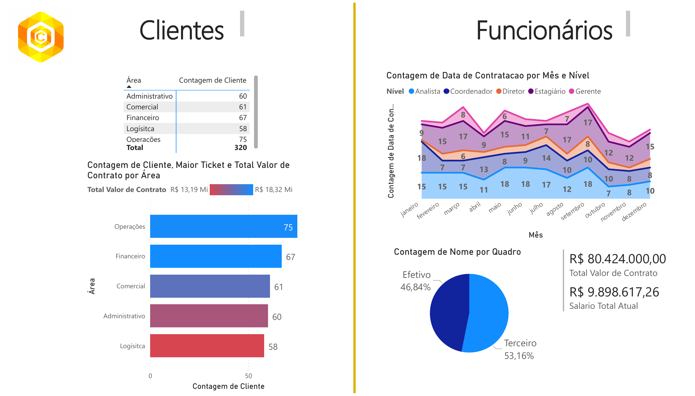
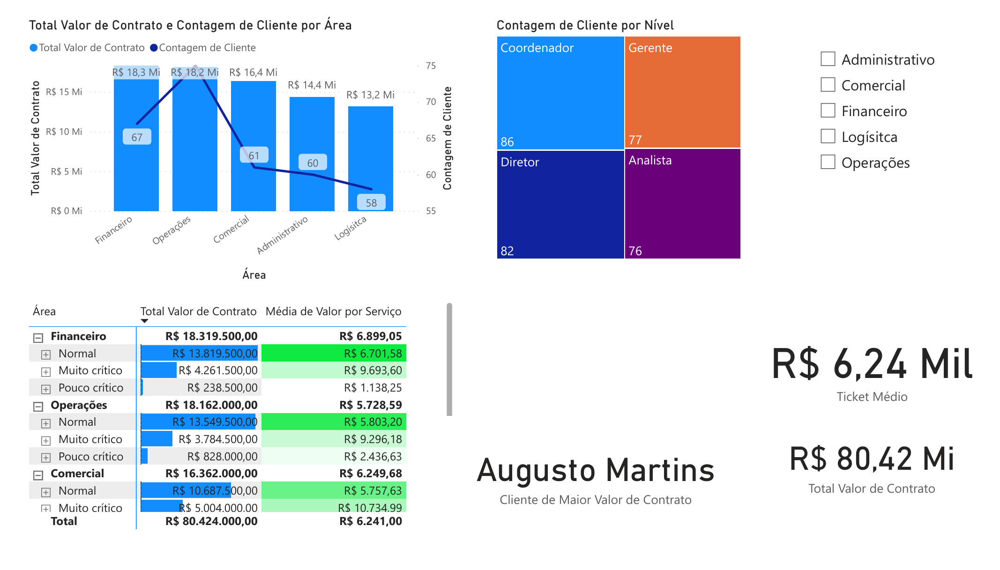
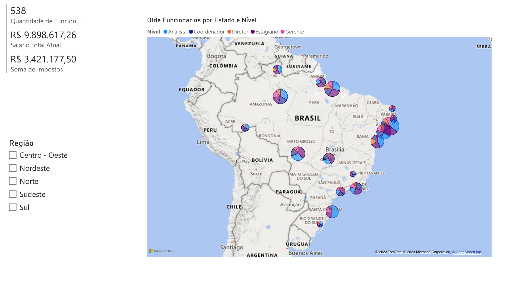

# HR & Clients Dashboard — Power BI

**Report:** [`dashboard-report.pdf`](dashboard-report.pdf) (exported from Power BI; labels in Portuguese)

## Overview
A 3-page Power BI report combining client-contract and workforce data for a company operating across Brazil:

- **Clients** — clients and contract value by business area, highest-value client, average ticket.
- **Contracts** — contract value by area and criticality level, with conditional formatting.
- **Workforce** — headcount by job level and hiring month, payroll and taxes, headcount by state on a map.

**Skills shown:** data modelling across client and employee tables, calculated measures (totals, averages, top client), KPI cards, slicers by area and region, and map visuals.

## Screenshots

