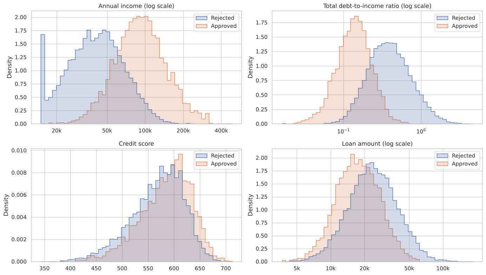
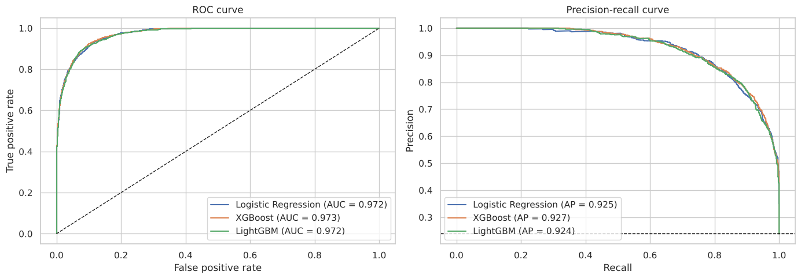

# Loan Approval Prediction

Notebook: [`loan_approval_prediction.ipynb`](loan_approval_prediction.ipynb)

## Problem

A lender wants to predict which loan applications will be approved, using only information available when the application is made, and to understand what drives the decision. The data is the synthetic [Financial Risk for Loan Approval](https://www.kaggle.com/datasets/lorenzozoppelletto/financial-risk-for-loan-approval) dataset from Kaggle: 20,000 applications with 36 columns, of which 23.9% were approved.

## Approach

1. Data checks: no missing values or duplicates. Two inconsistencies from the data generator were found and documented: monthly income that does not match annual income in 195 rows, and net worth that stays positive when debts exceed assets.
2. Exploratory analysis: compared approved and rejected applications on income, debt, credit score, loan size and categorical variables.
3. Leakage checks before modelling:
   - `RiskScore` alone reproduces 96.5% of decisions with one cut-off, so it was removed.
   - `InterestRate` is set by the lender as part of the decision, so it was removed.
   - `MonthlyLoanPayment` and `TotalDebtToIncomeRatio` are calculated exactly from `InterestRate`, so the final model leaves them out too.
   - `ApplicationDate` is just a row counter (one application per day from 2018 to 2072), so it was dropped.
4. Modelling: Logistic Regression, XGBoost and LightGBM in scikit-learn pipelines, compared with 5-fold cross-validation and then on a 30% test set.
5. Interpretation: permutation importance, logistic regression coefficients, and a table of approval thresholds.

## Results

- All three models reach a test ROC AUC of about 0.97. Logistic Regression performs as well as the boosted trees, so it is the final model because each decision can be explained.
- Removing the columns derived from the interest rate costs less than 0.005 in ROC AUC.
- Income is by far the most important factor, followed by loan amount. Net worth, length of credit history, education level and past bankruptcies or defaults come next. Applicants with a doctorate are approved 44% of the time, against 14% for high school.

| Threshold | Approved by model | Wrongly approved | Wrongly rejected | Precision | Recall |
|---|---|---|---|---|---|
| 0.5 | 1,716 | 427 | 145 | 0.75 | 0.90 |
| 0.7 | 1,428 | 233 | 239 | 0.84 | 0.83 |
| 0.8 | 1,272 | 153 | 315 | 0.88 | 0.78 |

The threshold should be chosen from the cost of a bad loan compared with the profit of a good one.

## Limitations

The data is synthetic and approval follows a scoring rule, which explains the high accuracy. Approval is also not the same as repayment: a real credit model would predict default.

## How to run

The dataset is in [`data/loan.csv`](data/loan.csv). Install the libraries in [`requirements.txt`](../requirements.txt) and run the notebook.
